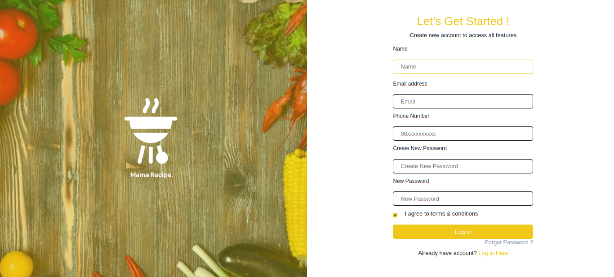
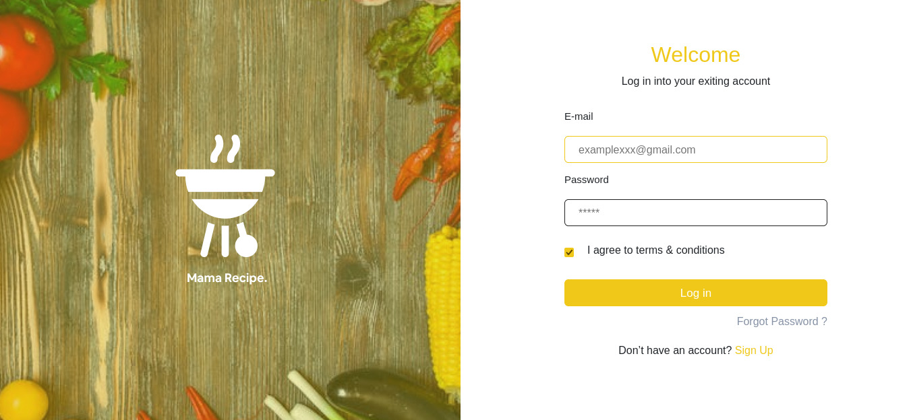
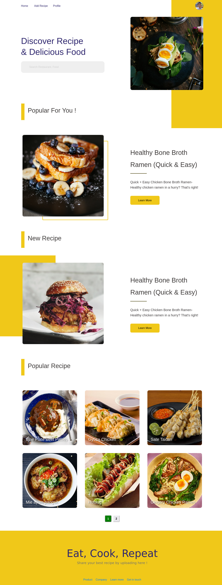
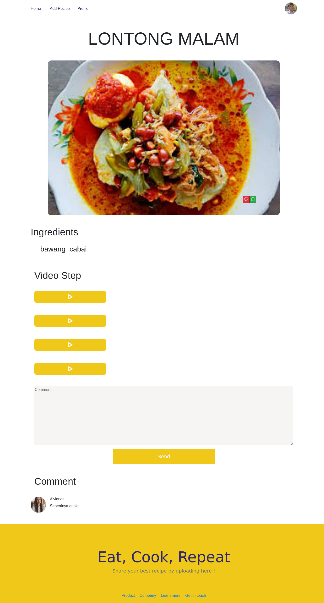
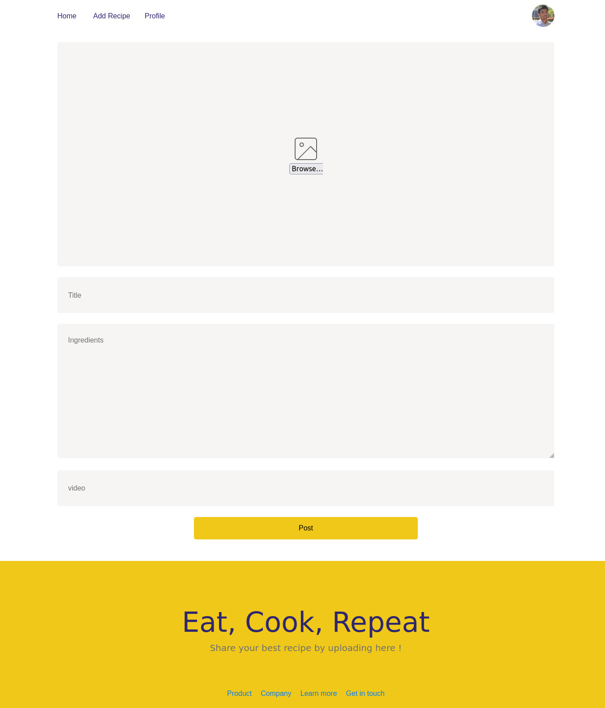
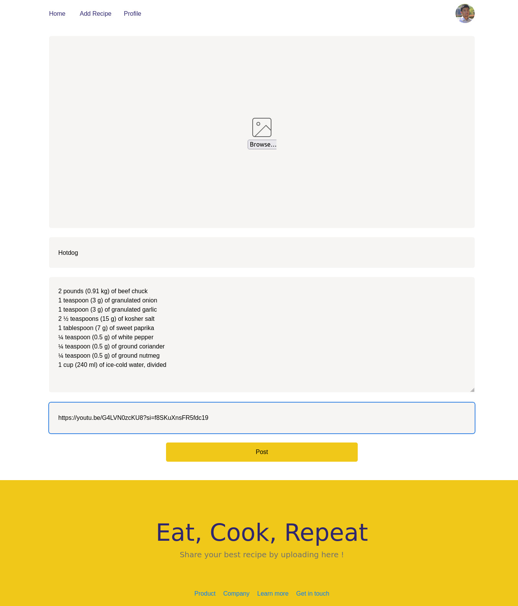
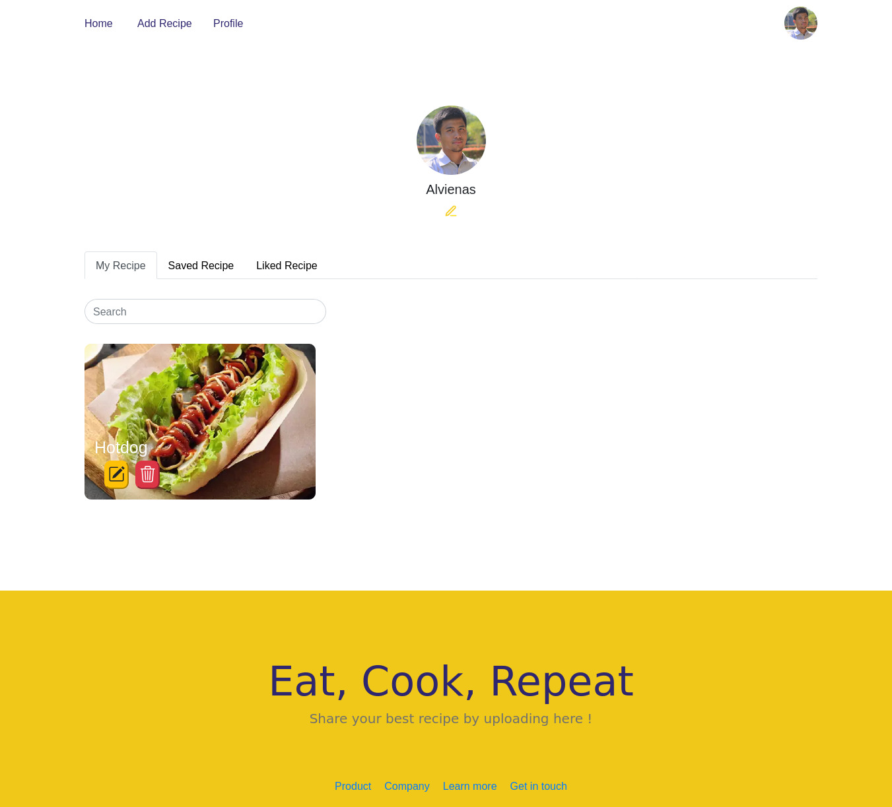
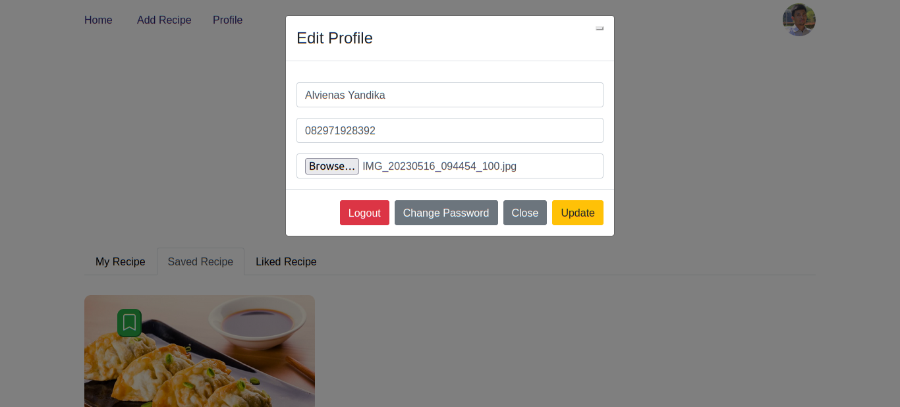
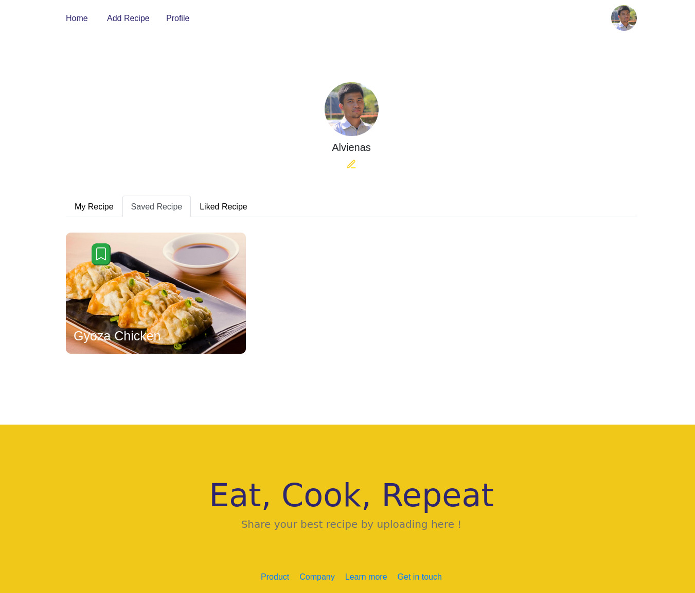
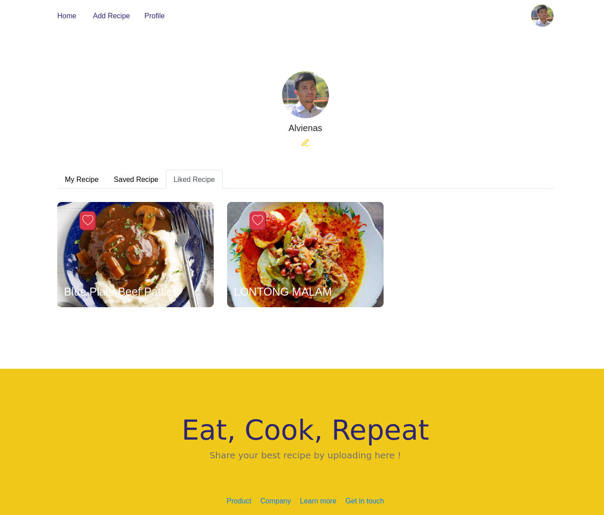

<p align="center">
<div align="center">
  
</div>
  <h3 align="center">My Recipe</h3>
  <p align="center">
    <a href="https://github.com/vineas/team-project_kelompok1_pijar_frontend"><strong>Explore the docs »</strong></a>
    <br />
    <a href="https://team-project-kelompok1-pijar-frontend.vercel.app">View Demo</a>
    <br />
    <a href="https://wild-tan-dog-kilt.cyclic.app/">Api Demo</a>
  </p>
</p>

<!-- TABLE OF CONTENTS -->

## Table of Contents

- [Table of Contents](#table-of-contents)
- [About The Project](#about-the-project)
  - [Built With](#built-with)
- [Getting Started](#getting-started)
  - [Prerequisites](#prerequisites)
  - [Installation](#installation)
  - [Setup .env](#setup-env)
- [Screenshots](#screenshots)
- [Contributing](#contributing)
- [Related Project](#related-project)
- [Contact](#contact)

<!-- ABOUT THE PROJECT -->

## About The Project

My Recipe is a food recipe website project that aims to inspire users to cook and share their favorite recipes. The name My Recipe means "let's cook" in Indonesian. On this website, users can search for recipes, share their own recipes, and connect with other food enthusiasts.

One of My Recipe's main features is its user-friendly search function. Users can search for recipes by food name. The website also provides detailed recipe instructions, ingredient lists, and video tutorials to assist users in the cooking process.

Another unique feature of My Recipe is that users can create their own profiles, connect with other users, and share their favorite recipes. This allows users to learn from each other and explore new culinary ideas.

To use the My Recipe website, users simply need to create an account and start searching or sharing recipes. The site is designed to be easy to use and accessible to all levels of culinary expertise

<!-- GETTING STARTED -->

## Getting Started

### Prerequisites

This is an example of how to list things you need to use the software and how to install them.

- [nodejs](https://nodejs.org/en/download/)
- [Bootstrap Css](https://getbootstrap.com/)
- [Vite JS](https://vitejs.dev/)
- [Redux](https://redux.js.org/)

### Installation

- Clone This Front End Repo

```
git clone https://github.com/vineas/team-project_kelompok1_pijar_frontend
```

- Go To Folder Repo

```
cd MyRecipe-frontend
```

- Install Module

```
npm install
```

- <a href="#setup-env">Setup .env</a>
- Type ` npm run dev` To Start Website
- Type ` npm run production` To Start Production

### Setup .env

Create .env file in your root project folder.

```
VITE_API_ENDPOINT = [BACKEND_URL]
```

<!-- ROADMAP -->

## Screenshots

<table>
  <tr>
    <td></td>
    <td> </td>
  </tr>
  <tr>
    <td>Register</td>
    <td>Login</td>
  </tr>

  <tr>
    <td></td>
    <td> </td>
  </tr>
  <tr>
    <td>Landing Page</td>
    <td>Detail Food</td>
  </tr>

  <tr>
    <td></td>
    <td> </td>
  </tr>
  <tr>
    <td>Create Food</td>
    <td>Edit Food</td>
  </tr>
  <tr>
    <td></td>
    <td> </td>
  </tr>
  <tr>
    <td>Profile</td>
    <td>Edit Profile</td>
  </tr>

  <tr>
    <td></td>
    <td> </td>
  </tr>
  <tr>
    <td>Saved Food</td>
    <td>Liked Food</td>
  </tr>

  <tr>  
    <!-- <td></td> -->
    <td> </td>
  </tr>
  <tr>
    <!-- <td>Search Result</td> -->
    <td>Recipe Video</td>
  </tr>

   <!-- <tr>
    <td></td>
    <td> </td>
  </tr>
  <tr>
    <td>Home - Mobile</td>
    <td>Profile - Mobile</td>
  </tr> -->
</table>
<!-- CONTRIBUTING -->

## Contributing

Contributions are what make the open source community such an amazing place to be learn, inspire, and create. Any contributions you make are **greatly appreciated**.

1. Fork the Project
2. Create your Feature Branch (`git checkout -b feature/AmazingFeature`)
3. Commit your Changes (`git commit -m 'Add some AmazingFeature'`)
4. Push to the Branch (`git push origin feature/AmazingFeature`)
5. Open a Pull Request

## Related Project

:rocket: [`Backend Markisak`](https://github.com/vineas11/team-project_kelompok1_pijar_backend/)

:rocket: [`Frontend Markisak`](https://github.com/vineas/team-project_kelompok1_pijar_frontend)

:rocket: [`Demo Markisak`](https://markisak-fe.vercel.app/)

<!-- Meet The Teams -->

## Meet The Teams

<center>
  <table align="center">
    <tr >
      <th >Frontend Developer / Project Manager</th>
      <th >Backend Developer</th>
      <th >Frontend Developer</th>
      <th >Backend Developer</th>
      <th >Frontend Developer</th>
    </tr>
    <tr >
      <td align="center">
        <a href="https://github.com/vineas">
          <br/>
          <b>Alvienas Yandika</b>
        </a>
      </td>
      <td align="center">
        <a href="https://github.com/izaazwaskito">
          <br/>
          <b>Izaaz Waskito</b>
        </a>
      </td>
      <td align="center">
        <a href="https://github.com/msuryasyahruli">
          <br/>
          <b>Muhammad Surya Syahruli</b>
        </a>
      </td>
      <td align="center">
        <a href="https://github.com/sandriirawan">
          <br/>
          <b>Sandri Irawan</b>
        </a>
      </td>
      <td align="center">
        <a href="https://github.com/yabeselkana">
          <br/>
          <b>Yabes Elkana</b>
        </a>
      </td>
    </tr>
  </table>
</center>

Deployment Project Link: [https://team-project-kelompok1-pijar-frontend.vercel.app](https://team-project-kelompok1-pijar-frontend.vercel.app)
Original Project Link: [https://github.com/ikkair/markisak-fe](https://github.com/ikkair/markisak-fe)